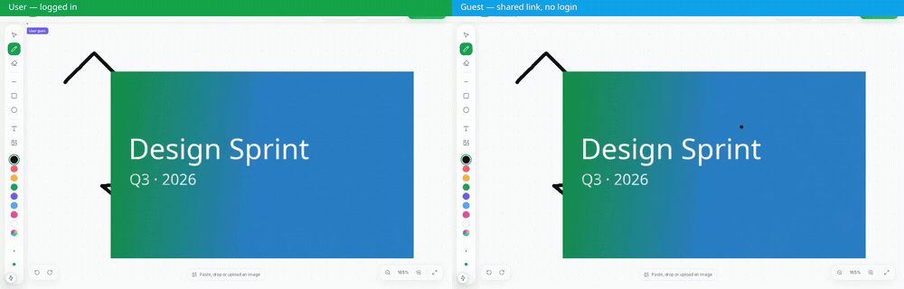
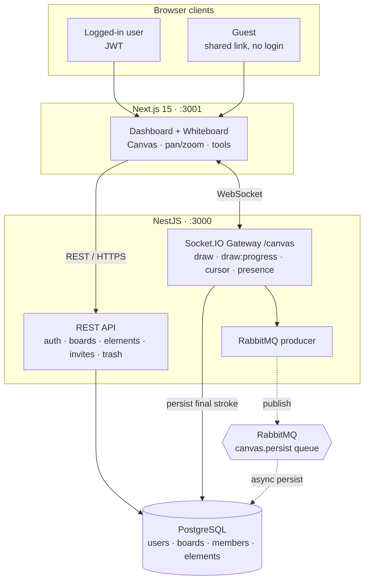

# Drawspace — Real-time Collaborative Whiteboard

A full-stack, real-time collaborative whiteboard (think **Figma / Miro / Excalidraw**) — draw together live, share a link, and anyone can join and edit **without signing in**.

Built with **NestJS · PostgreSQL · WebSockets · RabbitMQ** and a premium **Next.js 15** frontend.

<p align="center">
  
</p>

> **Left:** a logged-in user. **Right:** a guest who opened the shared link with **no account**. Both draw on the same infinite canvas and see each other live — cursors, strokes and images sync in real time.

---

## Features

- **Real-time collaboration** — strokes, shapes, text and images sync live over WebSockets; presence cursors show who's where
- **Public share links** — make a board public and anyone can open + edit it **without logging in** (anonymous guests)
- **JWT auth** — register / login, `bcrypt` hashing, protected routes, role-based access (owner / editor / viewer)
- **Rich canvas** — pencil, eraser, line, rectangle, circle, text and image tools
- **Images** — paste / drop / upload, then move and resize from **any side or corner**
- **Selection** — marquee-select, `Ctrl/⌘+A` select all, drag to move, 8-handle resize, `Delete` to remove
- **Infinite canvas** — pan in every direction (two-finger scroll / drag), pinch or `⌘+scroll` to zoom, **Fit to content**
- **Persistence** — every element saved to PostgreSQL and reloaded on open; view state (pan/zoom) remembered per board
- **Invites** — invite collaborators by email; boards track their members
- **Trash** — soft-delete to trash, restore or delete forever
- **Favorites** — star boards for quick access
- **Cluster mode & async pipeline** — Node.js `cluster` for multi-core scaling; RabbitMQ available for decoupled writes
- **Premium SaaS UI** — Obsera-inspired emerald design system, collapsible sidebar, Framer Motion, Lucide icons

---

## Architecture



**Modules:** `AuthModule` (JWT · Passport · bcrypt · `@Public()` guard bypass) · `UsersModule` · `BoardsModule` (boards · members RBAC · elements · trash · invite) · `CanvasModule` (Socket.IO gateway) · `RabbitMQModule` (async persist queue, graceful fallback).

**Draw flow:** while drawing, the client streams `draw:progress` (broadcast-only, no DB) so others render the stroke **point-by-point**; on stroke end it `emit('draw')` → gateway broadcasts to the room **and** persists to PostgreSQL → every other client (including anonymous guests) has it on reload.

---

## Tech Stack

| Layer | Tech |
|---|---|
| Backend | NestJS 11, TypeScript |
| Database | PostgreSQL + TypeORM |
| Real-time | Socket.IO WebSocket gateway |
| Queue | RabbitMQ (amqplib) |
| Auth | JWT, Passport, bcrypt |
| Frontend | Next.js 15 (App Router, Turbopack), React 19 |
| Styling | Tailwind CSS, Framer Motion, Lucide |
| Infra | Docker + Docker Compose |

---

## Getting Started

### Option A — Docker Compose (everything, one command)

**Prerequisites:** Docker + Docker Compose.

```bash
cp .env.example .env        # optional — sane defaults already baked in
docker compose up --build
```

This builds and starts **all four services** wired together:

| Service | URL |
|---|---|
| Frontend (Next.js) | http://localhost:3001 |
| Backend (NestJS API + WS) | http://localhost:3000 |
| PostgreSQL | `localhost:5432` |
| RabbitMQ management UI | http://localhost:15672 (`guest` / `guest`) |

The backend waits for Postgres **and** RabbitMQ health checks before booting.

### Option B — Local dev (hot reload)

**Prerequisites:** Node.js 20+, Docker (for infra only).

```bash
# 1. Infra
docker compose up -d postgres rabbitmq

# 2. Backend
cd backend && cp .env.example .env && npm install && npm run start:dev   # :3000

# 3. Frontend
cd frontend && npm install && npm run dev                                # :3001 (Turbopack)
```

Open http://localhost:3001, register, create a board and start drawing.
Make a board **Public**, hit **Share**, and open the link in another browser (or incognito) — no login needed.

---

## License

Released under the [MIT License](LICENSE).
